<!-- PROFILE HEADER -->

  

<h1 align="center">Christine Landayao</h1>

  
  
  

👩‍💻 About Me

    I am a 4th year college student taking  Bachelor of Science in Computer Engineering at Western Institute of Technology.

    Beyond academics, I enjoy dancing 💃 and cooking 🍳, which help me stay creative and inspired.

🏆 Seminars/ Webinars Certificates Gallery

  
  
  <a href="certificates/cert3.jpg">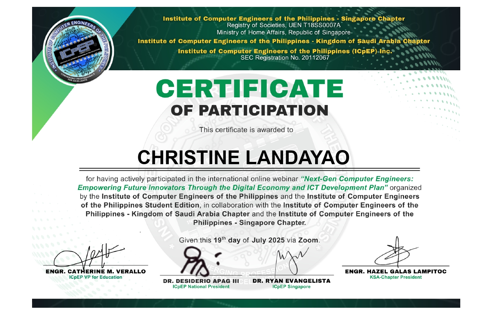</a>

  
  <a href="certificates/cert5.jpg">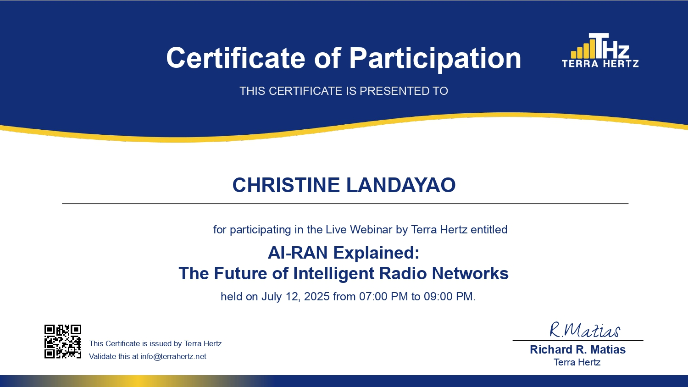</a>
  <a href="certificates/cert6.jpg">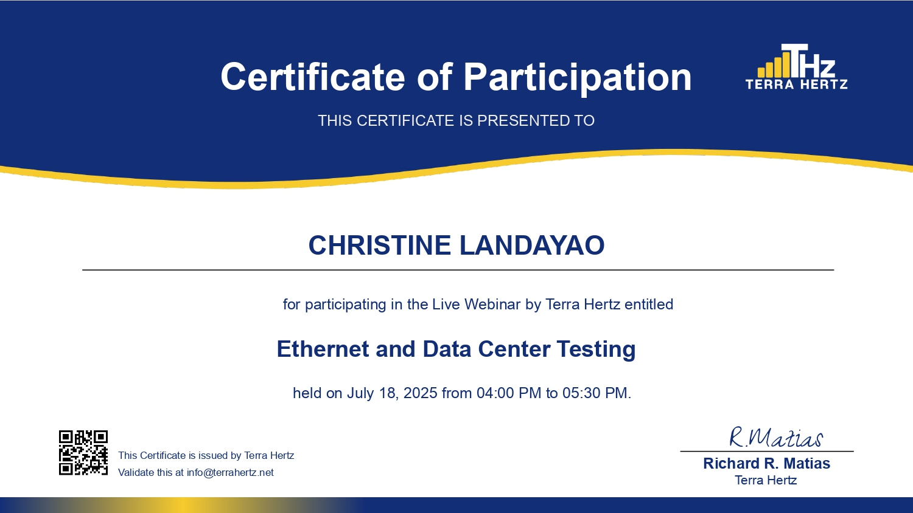</a>

  <a href="certificates/cert7.jpg">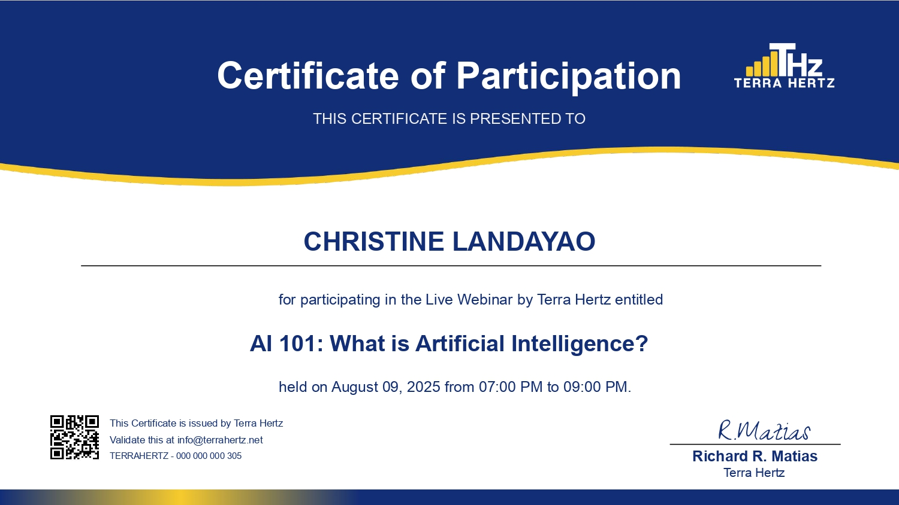</a>
  
  <a href="certificates/cert9.jpg">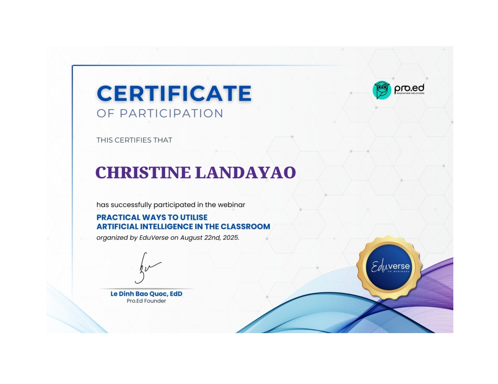</a>

  <a href="certificates/cert10.jpg">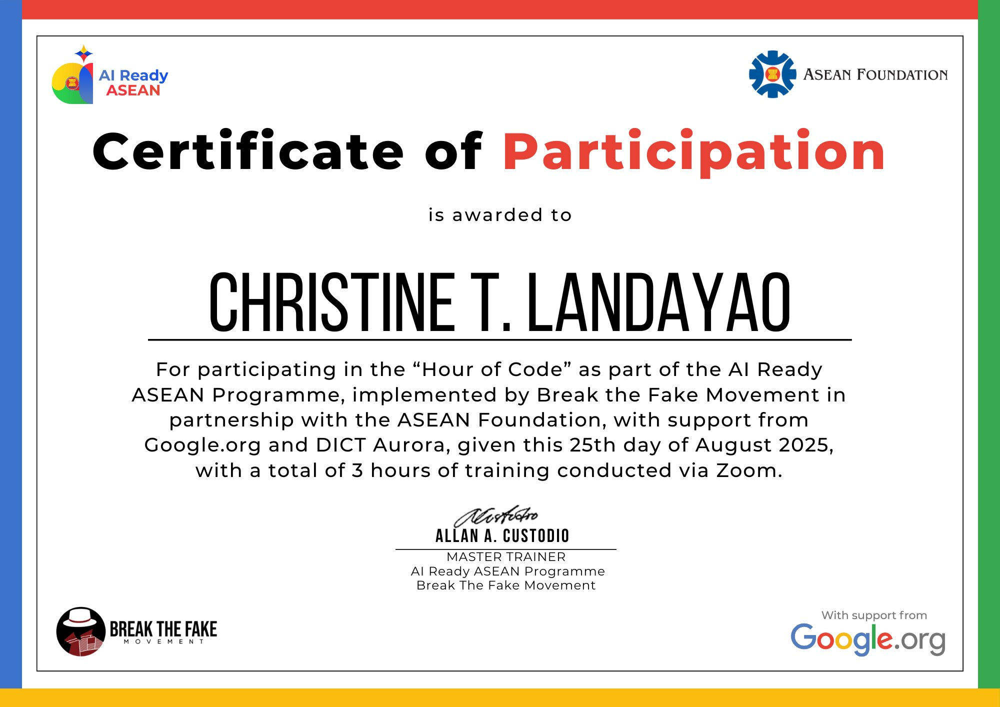</a>
  <a href="certificates/cert11.jpg">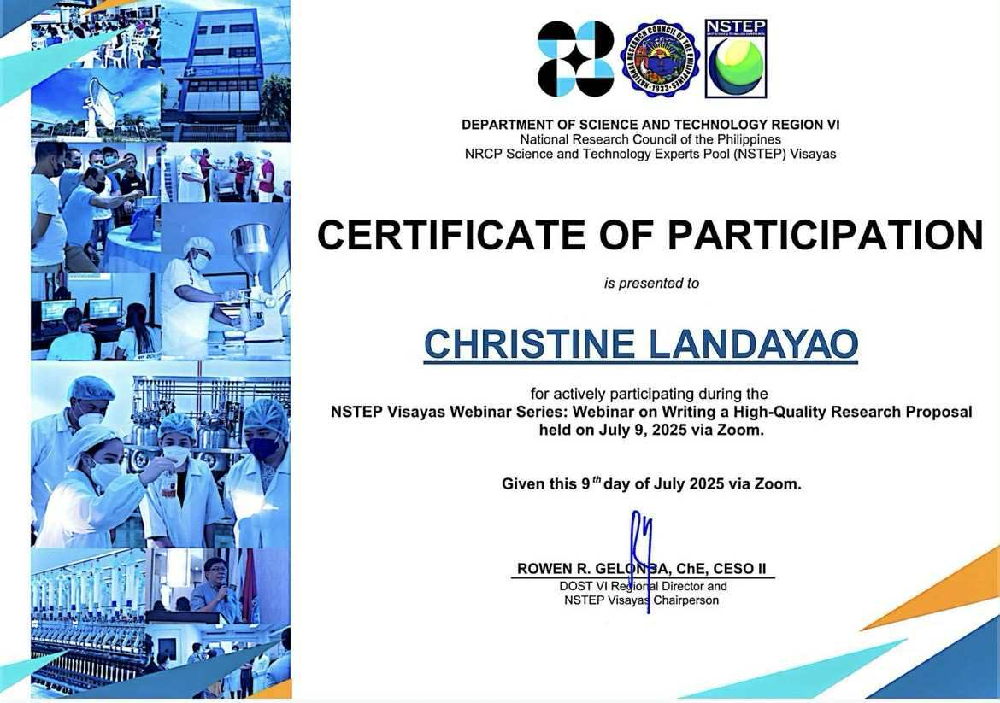</a>

<section>
  <h2>
    
    Cisco Networking Academy Courses Certifications
  </h2>

  <h3>Python Essentials 1</h3>
  

    <a href="certificates/python1.jpg" target="_blank">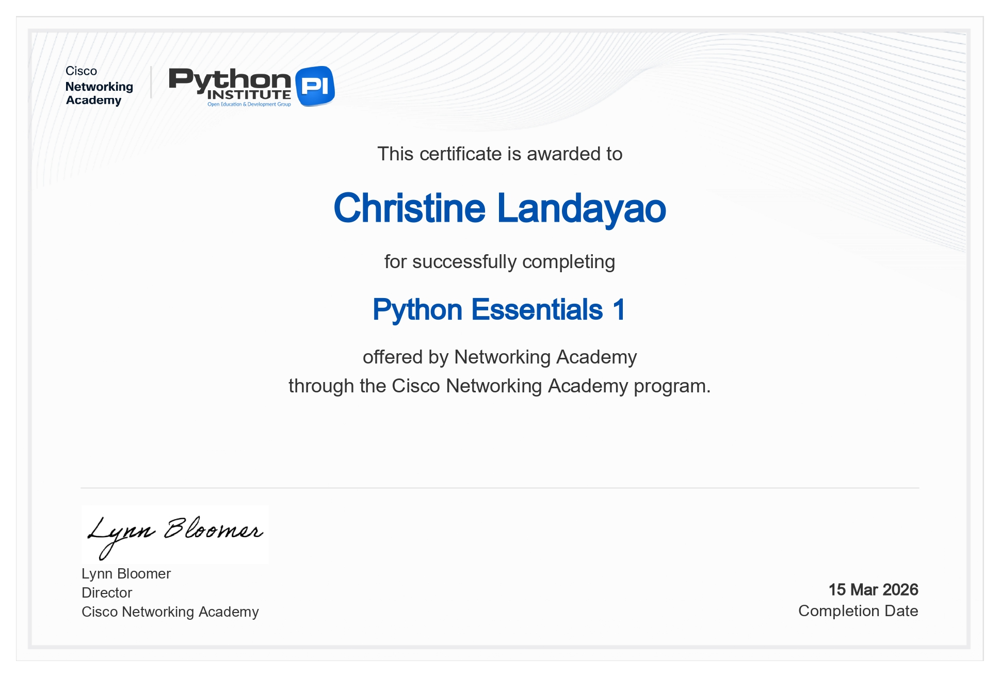</a>
    <a href="certificates/python1a.png" target="_blank">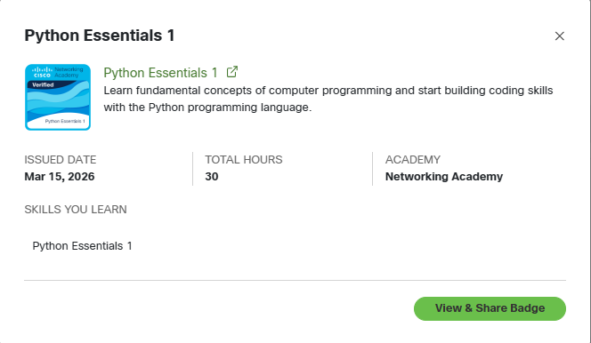</a>
  

  <ul>
        <li>Python syntax and structure</li>
        <li>Variables, data types, and operators</li>
        <li>Conditional statements (if, else, elif)</li>
        <li>Loops (for and while)</li>
        <li>Functions and basic modular programming</li>
        <li>Lists, tuples, and dictionaries</li>
  </ul>

  <h3>Python Essentials 2</h3>
  

    
    <a href="certificates/python2a.png" target="_blank">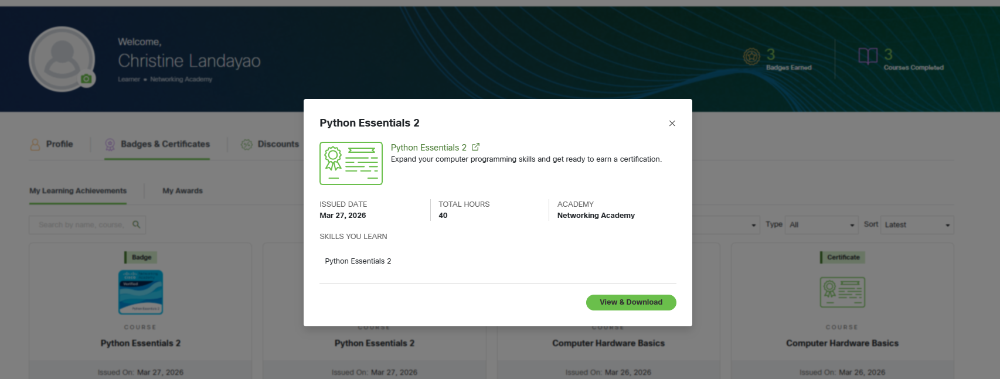</a>
  

  <ul>
        <li>Object-Oriented Programming (OOP)</li>
        <li>Classes and objects</li>
        <li>Inheritance and encapsulation</li>
        <li>File handling in Python</li>
        <li>Exception handling</li>
        <li>Modules and packages</li>
  </ul>

  <h3>Computer Hardware Basics</h3>
  

    <a href="certificates/hardware.jpg" target="_blank">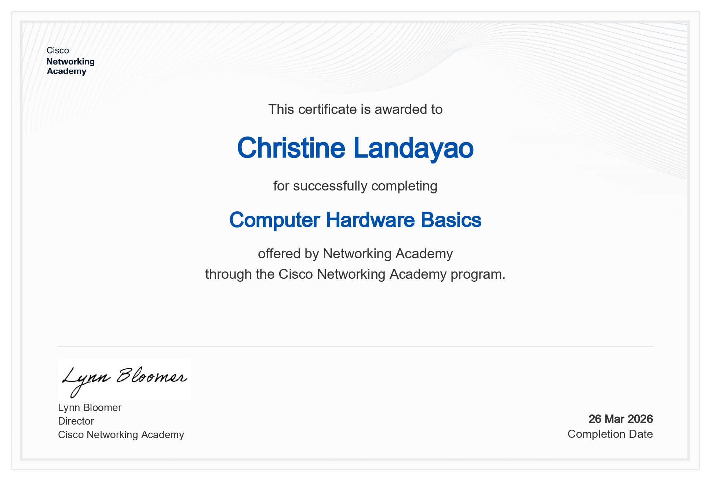</a>
    <a href="certificates/hardware2.png" target="_blank">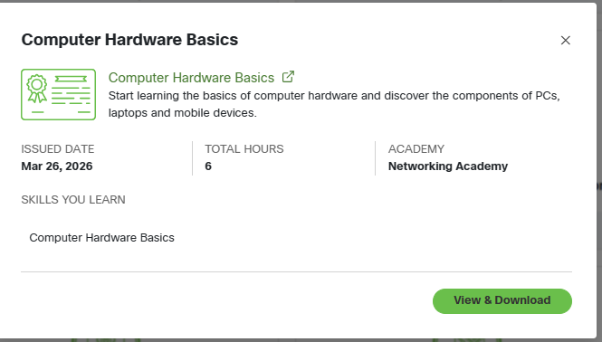</a>
  

  <ul>
        <li>Computer components and functions</li>
        <li>CPU, RAM, motherboard, storage devices</li>
        <li>Input and output devices</li>
        <li>Computer assembly basics</li>
        <li>Troubleshooting hardware issues</li>
        <li>Peripheral devices and ports</li>
  </ul>
</section>

<section>
  <h2>
    
    Udemy Course Certification
  </h2>

  <h3>Computer Hardware, Operating System, and Networking</h3>
  

    <a href="certificates/udemy.jpg" target="_blank">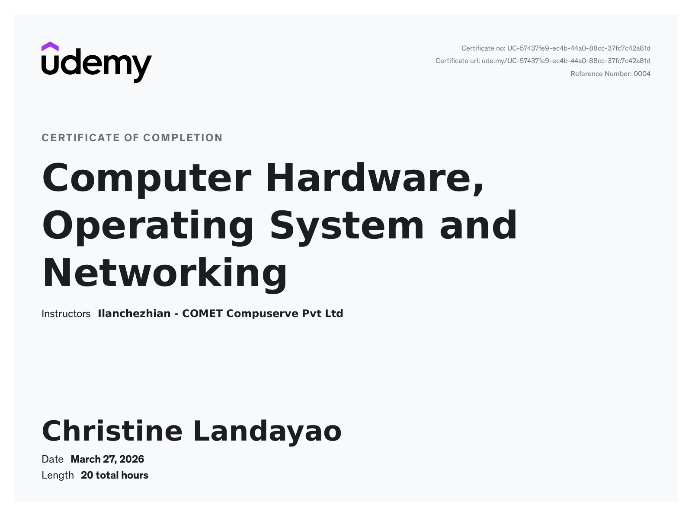</a>
  

  <ul>
        <li>Computer hardware components and architecture</li>
        <li>Operating system functions and types</li>
        <li>Windows and Linux basics</li>
        <li>Networking fundamentals</li>
        <li>IP addressing and subnet basics</li>
        <li>Network devices (router, switch, modem)</li>
        <li>Basic troubleshooting techniques</li>
        <li>Network security fundamentals</li>
  </ul>
</section>

**📄 Resume and Application Letter**

| **Resume** |
[View Resume](Landayao_Resume.pdf) 
| <a href="Landayao_Resume.pdf" download>Download Resume</a> |

| **Application Letter** |
[View Application Letter](application-letter(Landayao).pdf) 
| <a href="application-letter(Landayao).pdf" download>Download Letter</a> |

**📫 Contact Information**

Email: landayao.christinetcpe1996@email.com  
Phone: 0991-152-1772  
Location: Barotac Viejo, Iloilo, Philippines  

  ⭐ Thank you for visiting my GitHub profile!

